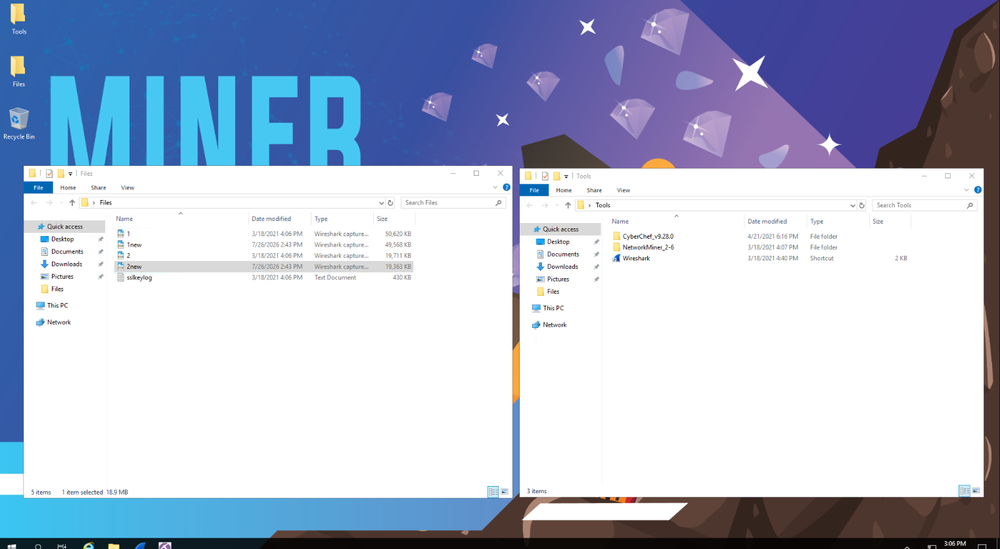
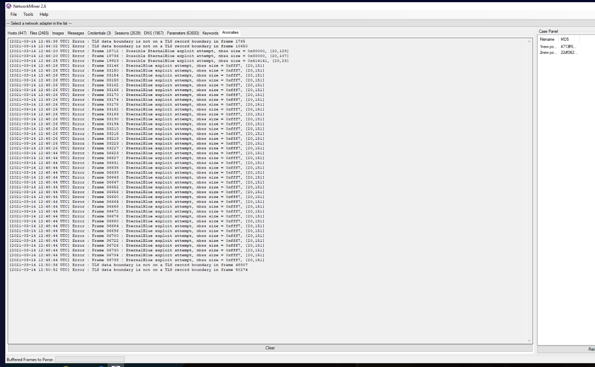
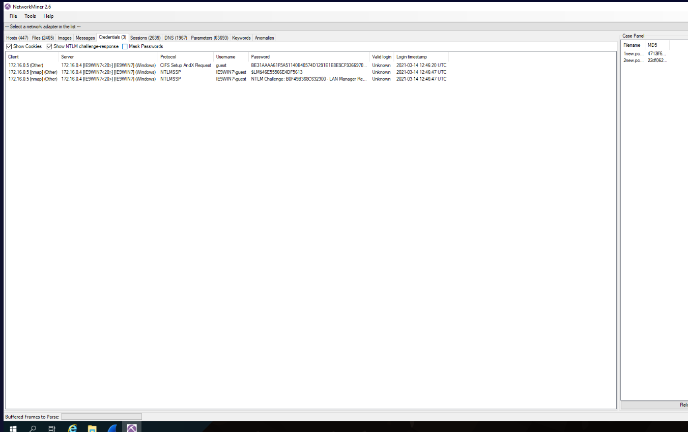
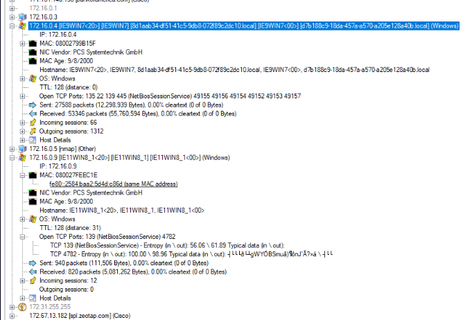
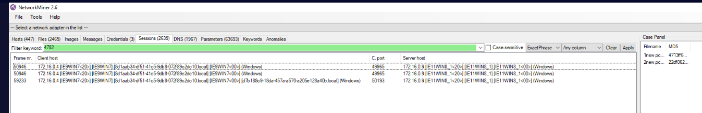
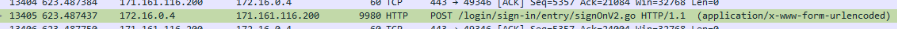
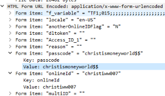
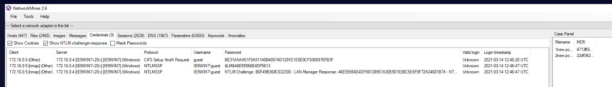

Our detection team reported that they received an IDS alert related to reconnaissance but they were unable to read the traffic as it was encrypted. Pcap files and analysis tools are available on the Desktop.  

### Questions to answer

1. According to NetworkMiner, what exploit attempt is being made on what protocol?
2. What is the IP address of the machine responsible that is conducting network scanning using Nmap?
3. Identify the C2 server. What is the hostname, MAC address, and listening port numbers?
4. What are the banking credentials of the victim?
5. What is the observed NTLM Response for the challenge from VICTIM Machine

## Findings

| Finding              | Result                                                        |
| -------------------- | ------------------------------------------------------------- |
| Exploit and protocol | `EternalBlue over SMB`                                        |
| Nmap scanning host   | `172.16.0.5`                                                  |
| C2 server            | `172.16.0.9`                                                  |
| C2 hostname          | `IE11WIN8_1`                                                  |
| C2 MAC address       | `08:00:27:EF:EC:1E`                                           |
| C2 listening ports   | TCP `139` and `4782`                                          |
| Banking credentials  | Online ID: `christiww007`<br>Passcode: `christismoneyworld$$` |
| NTLM response        | `46E55566E4DF5613`                                            |

## Investigation

### Identifying the tools and files
I started the investigation by reviewing the files on the desktop. The `Files` folder contained two packet captures and an `sslkeylog` file, while the `Tools` folder contained Wireshark and NetworkMiner. I initially attempted to open the captures in NetworkMiner, but it could not parse the original `.pcapng` format. I opened both captures in Wireshark and saved copies in `.pcap` format, which NetworkMiner could read.



*Figure 1: Files and tools available for the investigation.*

### Identifying the exploit attempt
The first question required me to identify the exploit and affected protocol. In NetworkMiner’s Anomalies tab, I observed multiple frames labeled as possible EternalBlue exploit attempts. Because EternalBlue targets the SMB protocol, I identified the activity as an EternalBlue exploit attempt over SMB.



*Figure 2: NetworkMiner identified repeated possible EternalBlue exploit attempts.*

### Identifying the scanning host
The second question required me to identify the host conducting the Nmap scan. I searched for Nmap-related activity and found that NetworkMiner labeled `172.16.0.5` as `[nmap]` in the Client column of the Credentials tab. Based on this evidence, I identified `172.16.0.5` as the scanning host.



*Figure 3: NetworkMiner labeled `172.16.0.5` as `[nmap]` in the Client column.*

### Identifying the C2 server
The third question required me to identify the command-and-control server. I first reviewed `172.16.0.5`, the host associated with the Nmap scan. Within the same subnet, I noticed that `172.16.0.4` had transferred a significant amount of data, which initially made it appear suspicious. Further review showed that traffic volume alone did not identify the C2 server. NetworkMiner showed that `172.16.0.9`, hostname `IE11WIN8_1`, was listening on TCP ports `139` and `4782` and had incoming sessions without corresponding outgoing sessions. Filtering the Sessions tab for port `4782` showed `172.16.0.4` acting as the client and connecting to `172.16.0.9`. This supported the identification of `172.16.0.9` as the likely C2 listener. Its MAC address was `08:00:27:EF:EC:1E`.



*Figure 4: NetworkMiner showed `172.16.0.9` listening on TCP ports `139` and `4782`, with incoming sessions and no outgoing sessions.*



*Figure 5: Filtering the Sessions tab for port `4782` showed `172.16.0.4` connecting to `172.16.0.9`.*
### Recovering the banking credentials
The fourth question required me to identify the victim’s banking credentials. I configured Wireshark to use the supplied TLS key-log file, allowing it to decrypt and display the previously encrypted application traffic. I then filtered for HTTP POST requests involving the suspected victim host: 

```wireshark
ip.addr == 172.16.0.4 && http.request.method == "POST"
```

The first capture did not contain an obvious credential submission, so I applied the same filter to the second capture. This revealed a POST request to `login/sign-in/entry/signOnv2.go`.



*Figure 6: The filtered traffic revealed a POST request to the banking login endpoint.*

In the request’s HTML form data, I expanded the `onlineID` and `passcode` fields and recovered the following banking credentials:
- Online ID: `christiww007`
- Passcode: `christismoneyworld$$`



*Figure 7: The decrypted HTML form data revealed the submitted `onlineID` and `passcode` values.*
### Extracting the NTLM response
The fifth question asked for the NTLM response associated with the challenge from the victim’s machine. I returned to NetworkMiner and opened the Credentials tab. I expanded the NTLMSSP authentication entry associated with the victim and recorded the value specifically labeled `NTLM Response`. The observed response was:



*Figure 8: NetworkMiner displayed the NTLM challenge and associated response.*

## Conclusion

The investigation identified an EternalBlue exploit attempt targeting SMB and showed that `172.16.0.5` was responsible for Nmap scanning activity. Further analysis identified `172.16.0.9`, hostname `IE11WIN8_1`, as the likely command-and-control server based on its listening ports, session behavior, and connection from the suspected victim host `172.16.0.4`.

Using the supplied TLS key-log file, I decrypted the captured traffic and recovered the victim’s submitted banking credentials from an HTTP POST request. I also used NetworkMiner to identify the NTLM response associated with the victim’s authentication activity. Together, the evidence showed reconnaissance, exploit activity, command-and-control communication, and exposure of sensitive credentials.

## Lessons Learned

This investigation reinforced the importance of using more than one analysis tool when reviewing packet captures. NetworkMiner made it easier to identify hosts, sessions, anomalies, Nmap activity, and authentication artifacts, while Wireshark provided the detailed packet inspection needed to decrypt TLS traffic and examine the HTTP form data.

One of the main difficulties was identifying the command-and-control server. I initially focused on `172.16.0.4` because it had transferred a large amount of data, but traffic volume alone was not enough to determine its role. Reviewing listening ports and filtering the session data for TCP port `4782` showed that `172.16.0.4` was connecting to `172.16.0.9`, which provided stronger evidence that `172.16.0.9` was the C2 listener.

I also learned not to assume that the first packet capture contains every answer. When the initial capture did not reveal an obvious credential submission, applying the same HTTP POST filter to the second capture exposed the banking login request. For future packet-capture investigations, I would review all available captures systematically and keep track of hosts, ports, filters, and evidence as they are identified.
